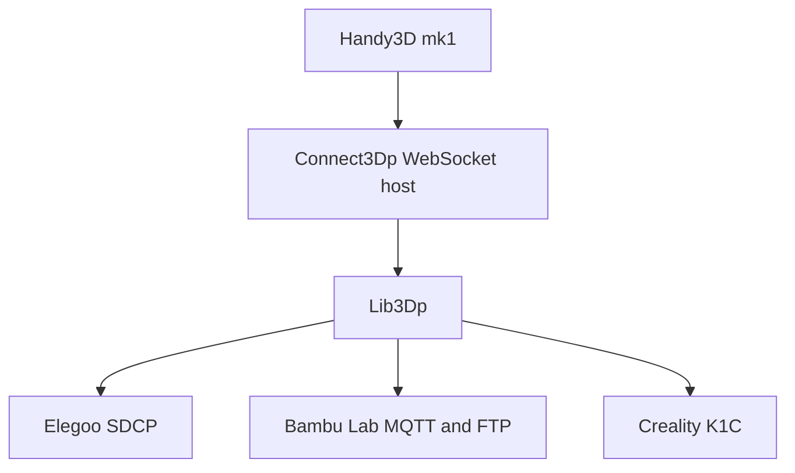
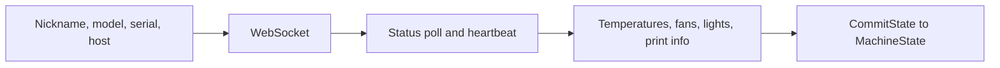
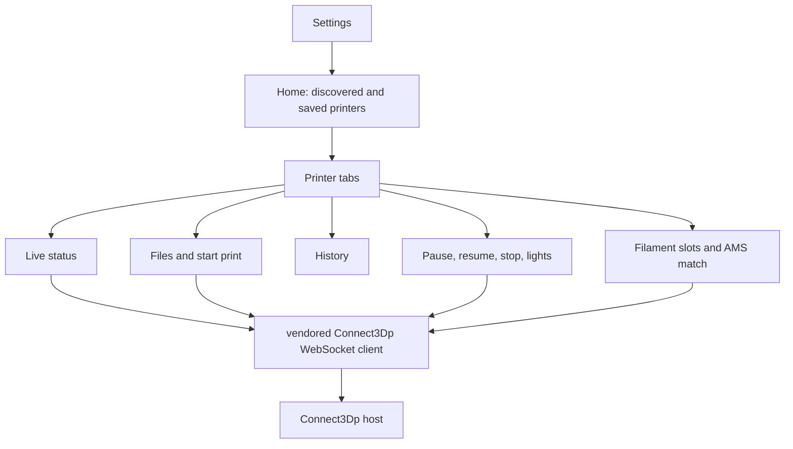

# Connect3Dp and Handy3D

A vendor-agnostic way to watch and control 3D printers, plus a phone app in front of it.

- Library and host: [AaronFJung/Connect3Dp](https://github.com/AaronFJung/Connect3Dp)
- Phone app: [AaronFJung/Handy3Dp](https://github.com/AaronFJung/Handy3Dp)

This page does not republish either tree. Packet layouts are not included.

## The whole system

Each printer brand speaks a different protocol. Connect3Dp hides that behind one machine model. A host process keeps the connections open. The phone app talks to the host, not to each vendor SDK.

**Lib3Dp** is the C# library. A connector subclasses `MachineConnection` and implements the protocol. The base class owns timeouts, scheduling, and state diffs. The connector overrides `Connect_Internal`, `Pause_Internal`, `Resume_Internal`, `Stop_Internal`, `PrintLocal_Internal`, and whatever else that brand can do. It reports what it supports with `MachineCapabilities`. The host only exposes operations the capability flags allow.

State changes go through `CommitState`. That applies the diff, runs scheduling, and notifies listeners. Callers get a `MachineOperationResult` instead of an exception for ordinary device failures.

**Connect3Dp.Host** is the ASP.NET Core process. It stores machine configs as JSON and print files on disk. Clients subscribe over a WebSocket. Topics cover configuration, live state, logs, pause, resume, stop, idle, and spool matching. A state change on a printer is broadcast to subscribed clients.

**Why this holds together:** the phone, and any later farm UI, only know `MachineStatus` and the shared topics. Adding a brand means a new connector, not a new app.

Brands in the library today: Elegoo Centauri Carbon, Bambu Lab, and Creality K1C.

## Elegoo

`ELEGOOMachineConnector` adapts Elegoo's SDCP protocol onto that shared model. The printer is a Centauri Carbon or Centauri Carbon 2, addressed by host name or IP. The connector opens a WebSocket, keeps a heartbeat, and polls status.

Commands the connector sends include start, pause, resume, and stop; file list, upload, and delete; history and history video; the video-stream toggle; lights; and fan speed. Incoming status values (`Printing`, `Suspended`, `Completed`, `Stopped`, and the rest of the SDCP status set) are mapped onto the shared `MachineStatus` enum, so the host treats an Elegoo like the other brands.

The protocol was recovered from the official web UI's network traffic. The command numbers live in `ELEGOOCmd`. They are not repeated here.

## Handy3D mk1

Expo app for a phone on the same network as the host. Display name in the app is Handy3D mk1. Package name in the tree is Farm3Dp.

**Stack:** Expo 54, React Native 0.81, React 19, expo-router, NativeWind, React Navigation, AsyncStorage, lucide icons. The websocket client is the `connect3dp` package under `vendor/connect3dp`.

The home screen greets the operator, probes the host, and lists printers found on the LAN plus printers saved by hand. Opening one shows status, files, and history in a bottom tab bar, with controls and filament on separate screens. Filament matching compares the job's materials to the spools loaded on the machine. The Elegoo camera path turns the printer's video stream on from the phone. Other brands do not use that call.

The useful screens need a Connect3Dp host and a printer. This page does not include a device screenshot for that reason.

## License

This note is separate from the two source repos. All rights reserved.
